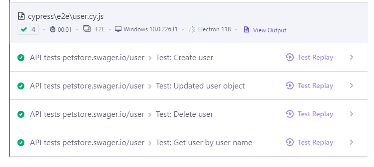

## Домашнее задание к занятию «7.7. Cypress 2»

#### Задача 3. Интеграционные тесты
Создан новый проект с API-тестами для  [проекта](https://petstore.swagger.io/v2)

- создания пользователя;
- правки пользователя;
- удаления пользователя.
- проект подключен к [Dashboard](https://cloud.cypress.io/projects/yb28nd/)

